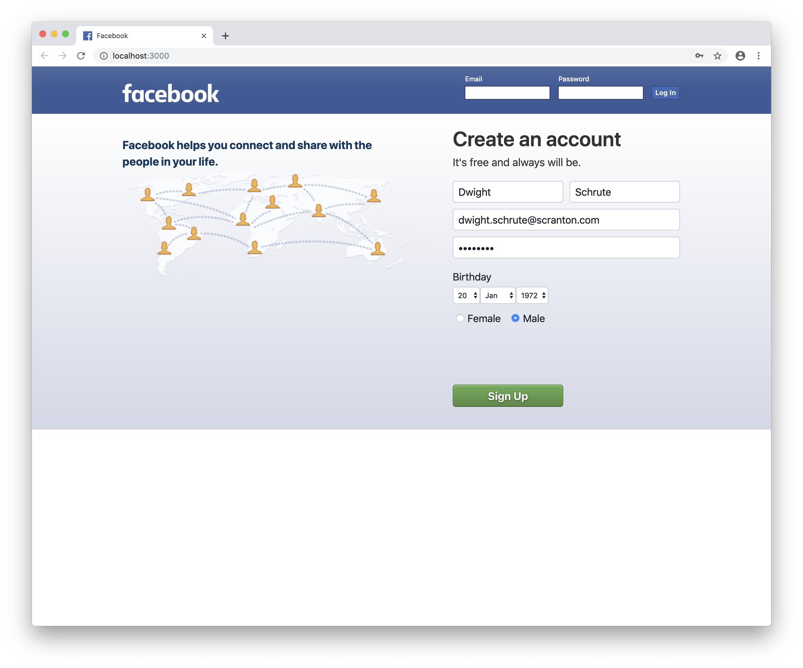
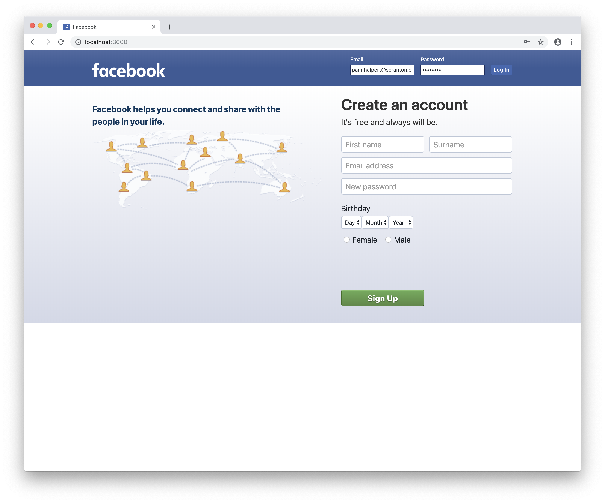

# Facebook Clone

This is a solo attempt at the engineering project from Makers weeks 9 and 10. The project was to duplicate the functionality of Facebook. Durinng weeks 9 and 10 the emphasis was on learning objectives; here I have attempted to deliver further functionality with an appearance closer to that of Facebook.

## Getting started

Assuming you have `git` installed, in the location of your choice, in Terminal:

`git clone git@github.com:alittlecross/facebook-clone.git`

`cd` into the `facebook-clone` folder.

Assuming you have Node.js and NPM installed, in that same location, in Terminal:

`npm install`

## Database Setup

Assuming you have `Homebrew` installed, in Terminal:

```
brew install postgresql

ln -sfv /usr/local/opt/postgresql/*.plist ~/Library/LaunchAgents
launchctl load ~/Library/LaunchAgents/homebrew.mxcl.postgresql.plist

psql postgres
```

Then paste the SQL script `CREATE DATABASE facebook;`

Change database using `\c facebook`.

Then paste the SQL scripts from the `migrations.sql` file in the root folder of the project.

If you intend to run tests, paste the SQL script `CREATE DATABASE facebook_test;`, change database using `\c facebook_test`, and repeat the above step.

Close postgres with `\q`.

Create local environmental variables by pasting each of the following into Terminal:

```
export PGUSER=
export PGPASSWORD=
export PGHOST=localhost
export PGDATABASE=facebook
export PGPORT=5432
```

## Local Usage

In that same location, in Terminal:

`npm start`

Then in the browser of your choice:

`http://localhost:3000/`

You should see the sign in/sign up page:



You can sign up for a new account or sign in if you are an existing user:



You will be taken to the news feed page that will show only your posts and those of people you are friends with. Friend requests can be sent, cancelled, or confirmed, or friendships removed by clicking the buttons on the right:


Each post shows comments, a count of likes and comments, and who has liked the post when hovering over the like count:


Write a post in the `Create post` box and press `Share`, or write a comment in the comment field and press `Comment`:


Your post will appear at the top of your news feed. Posts can be liked by clicking the grey thumbs up; likes can be removed by clicking the blue thumbs up.

## Running tests

`npm test`

## Linting

JavaScript files have been linted throughout the project using `StandardJS`
